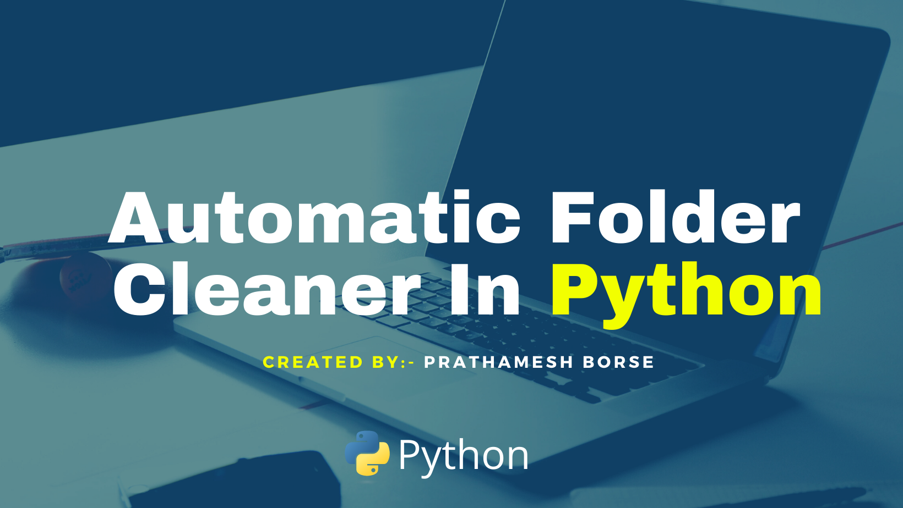

<h1 align="center">
Clean The Clutter
</h1>

<h4 align="center">
  This is a Python Program which helps you to clean all your garbage files like images, videos and other into a separate folders itself.
   
  Contribute to this repo and submit a PR
</h4>

*** 

  
  

## Video Example

## How to run this Website

1. `git clone git@github.com:viraldevpb/Clean_the_Clutter.git`
2. You will Need Python to run this Progarm, we will install Python in Step 3.
3. [Download](https://www.python.org/downloads/) Click on this link to install Python.
4. Click on the Extensions and Install Code Runner this will help you to run this Progarm.
5. If you want to run your Progarm in Powershell just type this command `Python main.py` 

## Special Credits

Spcial thanks to [@CodeWithHarry](https://github.com/CodeWithHarry) for letting me known about the python os module.
